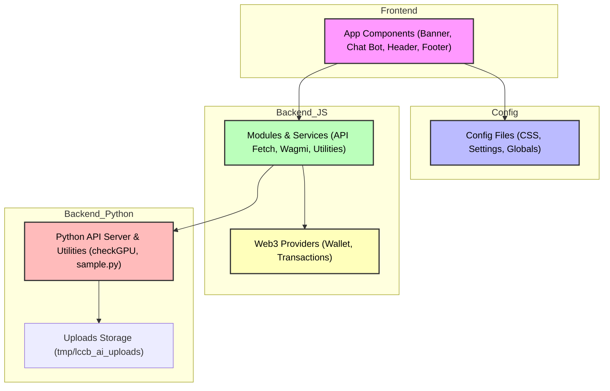

# About This Project

This project is an AI-powered PDF reader and assistant for La Consolacion College Bacolod.

With this app, you can:

- **Summarize PDF documents** using advanced Python AI models.
- **Ask questions** about your PDFs and get instant answers.
- **Chat with your documents** for a more interactive reading experience.

Built with Next.js and Python, this app combines modern web technologies and AI to help you work with documents smarter and faster.

# Getting Started

**Disclaimer:** This project does **not** collect any user data. All data is processed and stored locally on your machine.

## How to Run the Python API and Nextjs

1. Open this repository in your Codespace or clone to UBUNTU WSL.

2. In your terminal, run:

    ```sh
    ./setup.sh
    ```

3. Once setup is complete, open the web app

   [http://localhost:3000/](http://localhost:3000/)

## Config the RPC_Endpoint

1. Get your RPC at https://portal.cdp.coinbase.com/products/address-history

2. Config and Update the RPC_Endpoint in /src/app/config/conf/setting.json.

---

## Architecture Overview

LLCB AI is a modular AI project built using a **Service-Oriented Architecture (SOA)** approach.  
It integrates Web3 services, Python APIs, and frontend components for a scalable and maintainable system.




## Directory Tree

```bash
src
├── app
│   ├── components
│   │   ├── Banner
│   │   │   └── index.jsx
│   │   ├── Chat_bot
│   │   │   └── index.jsx
│   │   ├── Footer
│   │   │   └── index.jsx
│   │   ├── GlobalImports.js
│   │   └── Header
│   │       └── index.jsx
│   ├── config
│   │   ├── conf
│   │   │   ├── claimed.json
│   │   │   ├── root__config.css
│   │   │   └── setting.json
│   │   └── css
│   │       └── landpage
│   │           ├── banner.css
│   │           ├── chatbot.css
│   │           ├── global.css
│   │           └── header.css
│   ├── favicon.ico
│   ├── globals.css
│   ├── layout.js
│   ├── modules
│   │   ├── apis__fetch
│   │   │   ├── CheckConnections.js
│   │   │   ├── HandleAsk.js
│   │   │   └── HandleSubmit.js
│   │   ├── Modules__Imports.js
│   │   ├── utilitis
│   │   │   ├── Airdrop.js
│   │   │   └── SweetAlert2.js
│   │   └── Wagmi
│   │       ├── wagmi__client.js
│   │       └── wagmi__transactions.js
│   ├── page.js
│   └── services
│       ├── api
│       │   ├── airdrop
│       │   │   └── route.js
│       │   ├── ask__ai
│       │   │   └── route.js
│       │   ├── check__connections
│       │   │   └── route.js
│       │   └── Connect__python
│       │       └── route.js
│       └── web3_providers
│           ├── transactions
│           │   └── ERC20_ABI.json
│           └── Wallet__wagmi
│               └── coinbased__provider.js
└── python
    ├── api_server.py
    ├── checkGPU.py
    ├── __pycache__
    │   └── sample.cpython-313.pyc
    ├── sample.py
    └── tmp
        └── lccb_ai_uploads
            ├── 0xa0488357578fAEaf9e79050Fd6400Ef06C2867E4.pdf
            └── 0xD170b2A5441766ff39E1286a1dBD705D4735bFCe.pdf
```
